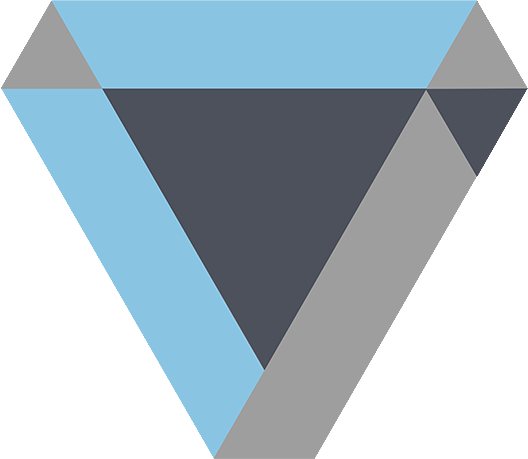

<!--
https://github.com/othneildrew/Best-README-Template
https://gist.github.com/lukas-h/2a5d00690736b4c3a7ba
https://github.com/aleen42/badges
https://github.com/Naereen/badges
-->

[![Contributors][contributors-shield]][contributors-url]
[![Forks][forks-shield]][forks-url]
[![Stargazers][stars-shield]][stars-url]
[![Issues][issues-shield]][issues-url]
[![MIT License][license-shield]][license-url]
[![LinkedIn][linkedin-shield]][linkedin-url]


<!-- PROJECT LOGO -->
<br />
<p align="center">
  <a href="https://github.com/jadahbakar/kawalrencanamu-backend">
    
  </a>
  <h3 align="center">Kawal Rencanamu - Backend</h3> <br />
</p>


<!-- TABLE OF CONTENTS -->
<details open="open">
  <summary>Table of Contents</summary>
  <ol>
    <li>
      <a href="#about-the-project">About The Project</a>
      <ul>
        <li><a href="#built-with">Built With</a></li>
      </ul>
    </li>
    <li>
      <a href="#getting-started">Getting Started</a>
      <ul>
        <li><a href="#prerequisites">Prerequisites</a></li>
        <li><a href="#installation">Installation</a></li>
      </ul>
    </li>
    <li><a href="#project-structure">Project structure</a></li>
    <li><a href="#license">License</a></li>
    <li><a href="#contact">Contact</a></li>
    <li><a href="#acknowledgements">Acknowledgements</a></li>
  </ol>
</details>


<!-- ABOUT THE PROJECT -->
## About The Project

This system is using for [Kawal Rencanamu][company-website] frontend and mobile system. right now we're using Monolith architecture, but it does not rule out the possibility we rewrite using Microservice architecture.

<!-- BUILD WITH -->
#### Built With

This section we explain what is backend is develop with 
* [Golang](https://golang.org)
* [Fiber](https://docs.gofiber.io/)
* [Viper](https://github.com/spf13/viper)


<!-- GETTING STARTED -->
## Getting Started

This is an example of how you may give instructions on setting up your project locally.
To get a local copy up and running follow these simple example steps.

<!-- PREREQUISITES -->
#### Prerequisites

* First you need to install [Golang](https://golang.org/doc/install)

* After that check the installation and Golang version it must be above than 1.11 because we need the [Golang Modules](https://blog.golang.org/using-go-modules)
  ```sh
  > go version
  go version go1.16.3 darwin/amd64
   ```


<!-- INSTALLATION -->
#### Installation

1. Clone the repo
   ```sh
   git clone https://github.com/jadahbakar/kawalrencanamu-backend.git
   ```
2. Install Modules packages
   ```sh
   go mod update
   ```


<!-- Project structure -->
## Project Structure

```
kawalrencanamu-backend/
├── LICENSE.txt
├── README.md
├── app.env
├── cmd
│   └── httpserver
│       └── main.go
├── go.mod
├── go.sum
├── images
│   ├── golang.svg
│   └── kawalrencanamu.png
├── internal
│   └── me
│       └── service.go
├── log
│   └── fiber.log
├── log.md
└── pkg
    ├── config
    │   ├── appConfig.go
    │   ├── fiberConfig.go
    │   └── logerConfig.go
    ├── middleware
    │   ├── fiberMiddleware.go
    │   └── jwtMiddleware.go
    ├── routes
    │   ├── not_found_route.go
    │   └── public_routes.go
    └── utils
        ├── jwt_generator.go
        ├── jwt_parser.go
        └── startServer.go
```


<!-- LICENSE -->
## License

Distributed under the Proprietary License. See `LICENSE` for more information.


<!-- CONTACT -->
## Contact

Dedy Styawan - [dedy.styawan](https://twitter.com/dedystyawan) - dedy.styawan@gmail.com

Setiadi Akbar - [setiadi](https://twitter.com/setiadiakbar) - setiadiakbar0@gmail.com


<!-- ACKNOWLEDGEMENTS -->
## Acknowledgements
* [Build Docker Image](https://github.com/target/flottbot/blob/master/docker/Dockerfile)
* [Building APIs with Go — Part 2 --> the newest ](https://fernando-bandeira.medium.com/building-apis-with-go-part-2-4afc50fd0ff8)
* [hexagonal-architecture-in-go -> using it now](https://medium.com/@matiasvarela/hexagonal-architecture-in-go-cfd4e436faa3)
* [stygis-golang-hexagonal-architecture](https://idevoid.medium.com/stygis-golang-hexagonal-architecture-a2d89d01f84b)
* [how-i-structure-services-in-go](https://medium.com/@ott.kristian/how-i-structure-services-in-go-19147ad0e6bd)
* [Load config from file & environment variables in Golang with Viper](https://dev.to/techschoolguru/load-config-from-file-environment-variables-in-golang-with-viper-2j2d)
* [Go Fiber](https://gofiber.io/)
* [Go Fiber 2](https://dev.to/koddr/build-a-restful-api-on-go-fiber-postgresql-jwt-and-swagger-docs-in-isolated-docker-containers-475j)
* [semver for versioning](https://github.com/Masterminds/semver/)
* [string to ascii](https://patorjk.com/software/taag/#p=display&h=2&v=3&f=Graceful&t=BUILD)


<!-- MARKDOWN LINKS & IMAGES -->
<!-- https://www.markdownguide.org/basic-syntax/#reference-style-links -->
[company-website]:http://kawalrencanamu.com/
[contributors-shield]: https://img.shields.io/github/contributors/jadahbakar/kawalrencanamu-backend.svg?style=for-the-badge
[contributors-url]: https://github.com/jadahbakar/kawalrencanamu-backend/graphs/contributors
[forks-shield]: https://img.shields.io/github/forks/jadahbakar/kawalrencanamu-backend.svg?style=for-the-badge
[forks-url]: https://github.com/jadahbakar/kawalrencanamu-backend/network/members
[stars-shield]: https://img.shields.io/github/stars/jadahbakar/kawalrencanamu-backend.svg?style=for-the-badge
[stars-url]: https://github.com/jadahbakar/kawalrencanamu-backend/stargazers
[issues-shield]: https://img.shields.io/github/issues/jadahbakar/kawalrencanamu-backend.svg?style=for-the-badge
[issues-url]: https://github.com/jadahbakar/kawalrencanamu-backend/issues
[license-shield]: https://img.shields.io/github/license/jadahbakar/kawalrencanamu-backend.svg?style=for-the-badge
[license-url]: https://github.com/jadahbakar/kawalrencanamu-backend/blob/master/LICENSE.txt
[linkedin-shield]: https://img.shields.io/badge/-LinkedIn-black.svg?style=for-the-badge&logo=linkedin&colorB=555
[linkedin-url]: https://linkedin.com/in/dedystyawan
[product-screenshot]: images/screenshot.png
[logo-screenshot]: images/screenshot.png
[golang-image]: images/golang.png
[golang-install-url]: https://golang.org/doc/install

