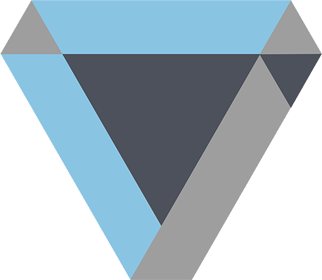

<!--
*** Thanks for checking out the kawalrencanamu-backend. If you have a suggestion
*** that would make this better, please fork the repo and create a pull request
*** or simply open an issue with the tag "enhancement".
*** Thanks again! Now go create something AMAZING! :D
-->


<!-- PROJECT SHIELDS -->
<!--
*** I'm using markdown "reference style" links for readability.
*** Reference links are enclosed in brackets [ ] instead of parentheses ( ).
*** See the bottom of this document for the declaration of the reference variables
*** for contributors-url, forks-url, etc. This is an optional, concise syntax you may use.
*** https://www.markdownguide.org/basic-syntax/#reference-style-links
-->
[![Contributors][contributors-shield]][contributors-url]
[![Forks][forks-shield]][forks-url]
[![Stargazers][stars-shield]][stars-url]
[![Issues][issues-shield]][issues-url]
[![MIT License][license-shield]][license-url]
[![LinkedIn][linkedin-shield]][linkedin-url]


<!-- PROJECT LOGO -->
<br />
<p align="center">
  <a href="https://github.com/jadahbakar/kawalrencanamu-backend">
    
  </a>

  <h3 align="center">Kawal Rencanamu Backend</h3> <br />
<!-- 
  <p align="center">
    An awesome README template to jumpstart your projects!
    <br />
    <a href="https://github.com/jadahbakar/kawalrencanamu-backend"><strong>Explore the docs »</strong></a>
    <br />
    <br />
    <a href="https://github.com/jadahbakar/kawalrencanamu-backend">View Demo</a>
    ·
    <a href="https://github.com/jadahbakar/kawalrencanamu-backend/issues">Report Bug</a>
    ·
    <a href="https://github.com/jadahbakar/kawalrencanamu-backend/issues">Request Feature</a>
  </p> -->
</p>


<!-- TABLE OF CONTENTS -->
<details open="open">
  <summary>Table of Contents</summary>
  <ol>
    <li>
      <a href="#about-the-project">About The Project</a>
      <ul>
        <li><a href="#built-with">Built With</a></li>
      </ul>
    </li>
    <li>
      <a href="#getting-started">Getting Started</a>
      <ul>
        <li><a href="#prerequisites">Prerequisites</a></li>
        <li><a href="#installation">Installation</a></li>
      </ul>
    </li>
    <li><a href="#usage">Usage</a></li>
    <li><a href="#project-structure">Project structure</a></li>
    <li><a href="#contributing">Contributing</a></li>
    <li><a href="#license">License</a></li>
    <li><a href="#contact">Contact</a></li>
    <li><a href="#acknowledgements">Acknowledgements</a></li>
  </ol>
</details>


<!-- ABOUT THE PROJECT -->
## About The Project

<!-- [![Product Name Screen Shot][product-screenshot]](https://example.com) -->

This system is using for kawalrencanamu frontend and mobile system. right now we're using Monolith architecture, but it does not rule out the possibility we rewrite using Microservice architecture.


### Built With

This section we explain what is backend is develop with 
* [Golang](https://golang.org)
* [Fiber](https://docs.gofiber.io/)
* [Viper](https://github.com/spf13/viper)


<!-- GETTING STARTED -->
## Getting Started

This is an example of how you may give instructions on setting up your project locally.
To get a local copy up and running follow these simple example steps.

### Prerequisites

* First you need to install [Golang](https://golang.org/doc/install)
* After that check the installation
  ```sh
  >  go version
  go version go1.16.3 darwin/amd64
   ```
* Check the version, must be minimum 1.11 because we need the [Golang Modules](https://blog.golang.org/using-go-modules)


### Installation

1. Clone the repo
   ```sh
   git clone https://github.com/jadahbakar/kawalrencanamu-backend.git
   ```
2. Install Modules packages
   ```sh
   go mod update
   ```


<!-- USAGE EXAMPLES -->
## Usage

Use this space to show useful examples of how a project can be used. Additional screenshots, code examples and demos work well in this space. You may also link to more resources.

_For more examples, please refer to the [Documentation](https://example.com)_


<!-- Project structure -->
## Project Structure


```
kawalrencanamu-backend/
├── bin                   # This is where the main application is saved, technically this is the destination for go build
├── cmd                   # Any of main application here,
│     └── httpserver      # The requests from API are being organized
├── initiator             # initialize any domain here that will be called inside cmd, so, no spaghetti init on cmd main package
├── internal              # The business logic(the flow of data for this project). Meaning it shouldn’t be exported outside of the project.
│     ├── handler         # The requests from API are being organized
│     │     └── xxx  
│     │           └── y  
│     ├── middleware      # Contains packages of the middleware from the technologies are being used 
│     │     └── xxx  
│     │           └── y  
│     ├── model           # Model is where the declaration of structs are being written
│     │     └── xxx  
│     │           └── y  
│     └── repository      # Uses for data storing logic, 
│           └── xxx  
│                 └── y  
│    
│
├── mocks                 # 
│     ├── psql            # this is mock for psql contains package mock_psql, even tho it is written manually, it must have
│     ├── redis           # this is mock for redis contains package mock_redis, even tho it is written manually, it must have 
│     └── user            # this is generated by golang mock official generator
├── platform/pkg          # external app for all uses (in here you can make function without return)
│     ├── encryption      # you can have any encryption method here
│     ├── postgres        # contains functions to open database postgres connections, with mutiple servers can be added
│     ├── redis           # contains functions to open database redis connection, currently it uses only one connection
│     └── routers         # contains functions to serve the HTTP Listener using all registered URLs with the handlers
└── static                # to store any static file like pic, html, etc 
```


<!-- CONTRIBUTING -->
## Contributing

Contributions are what make the open source community such an amazing place to be learn, inspire, and create. Any contributions you make are **greatly appreciated**.

1. Fork the Project
2. Create your Feature Branch (`git checkout -b feature/AmazingFeature`)
3. Commit your Changes (`git commit -m 'Add some AmazingFeature'`)
4. Push to the Branch (`git push origin feature/AmazingFeature`)
5. Open a Pull Request


<!-- LICENSE -->
## License

Distributed under the MIT License. See `LICENSE` for more information.


<!-- CONTACT -->
## Contact

Dedy Styawan - [dedy.styawan](https://twitter.com/dedystyawan) - dedy.styawan@gmail.com

Setiadi Akbar - [setiadi](https://twitter.com/setiadiakbar) - setiadiakbar0@gmail.com

<!-- Project Link: [https://github.com/your_username/repo_name](https://github.com/your_username/repo_name) -->


<!-- ACKNOWLEDGEMENTS -->
## Acknowledgements
* [hexagonal-architecture-in-go -> using it now](https://medium.com/@matiasvarela/hexagonal-architecture-in-go-cfd4e436faa3)
* [stygis-golang-hexagonal-architecture](https://idevoid.medium.com/stygis-golang-hexagonal-architecture-a2d89d01f84b)
* [how-i-structure-services-in-go](https://medium.com/@ott.kristian/how-i-structure-services-in-go-19147ad0e6bd)
<!-- 
* [GitHub Emoji Cheat Sheet](https://www.webpagefx.com/tools/emoji-cheat-sheet)
* [Img Shields](https://shields.io)
* [Choose an Open Source License](https://choosealicense.com)
* [GitHub Pages](https://pages.github.com)
* [Animate.css](https://daneden.github.io/animate.css)
* [Loaders.css](https://connoratherton.com/loaders)
* [Slick Carousel](https://kenwheeler.github.io/slick)
* [Smooth Scroll](https://github.com/cferdinandi/smooth-scroll)
* [Sticky Kit](http://leafo.net/sticky-kit)
* [JVectorMap](http://jvectormap.com)
* [Font Awesome](https://fontawesome.com) 
-->


<!-- MARKDOWN LINKS & IMAGES -->
<!-- https://www.markdownguide.org/basic-syntax/#reference-style-links -->
[contributors-shield]: https://img.shields.io/github/contributors/jadahbakar/kawalrencanamu-backend.svg?style=for-the-badge
[contributors-url]: https://github.com/jadahbakar/kawalrencanamu-backend/graphs/contributors
[forks-shield]: https://img.shields.io/github/forks/jadahbakar/kawalrencanamu-backend.svg?style=for-the-badge
[forks-url]: https://github.com/jadahbakar/kawalrencanamu-backend/network/members
[stars-shield]: https://img.shields.io/github/stars/jadahbakar/kawalrencanamu-backend.svg?style=for-the-badge
[stars-url]: https://github.com/jadahbakar/kawalrencanamu-backend/stargazers
[issues-shield]: https://img.shields.io/github/issues/jadahbakar/kawalrencanamu-backend.svg?style=for-the-badge
[issues-url]: https://github.com/jadahbakar/kawalrencanamu-backend/issues
[license-shield]: https://img.shields.io/github/license/jadahbakar/kawalrencanamu-backend.svg?style=for-the-badge
[license-url]: https://github.com/jadahbakar/kawalrencanamu-backend/blob/master/LICENSE.txt
[linkedin-shield]: https://img.shields.io/badge/-LinkedIn-black.svg?style=for-the-badge&logo=linkedin&colorB=555
[linkedin-url]: https://linkedin.com/in/dedystyawan
[product-screenshot]: images/screenshot.png
[logo-screenshot]: images/screenshot.png
